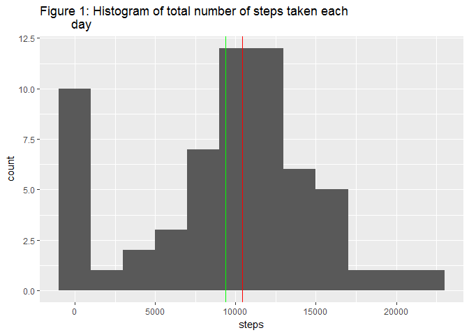
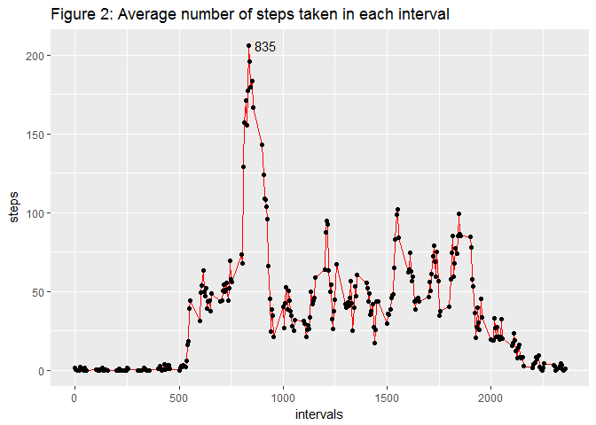
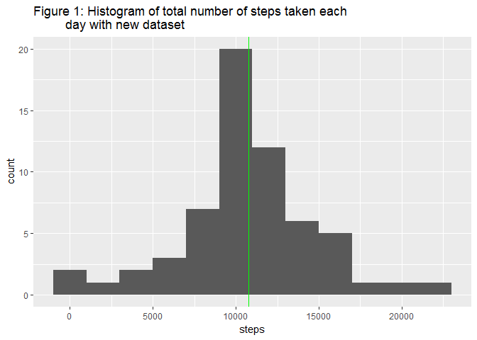
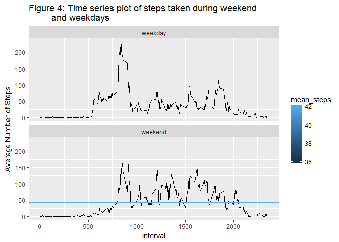

# Course project 1
Mohammad W. Ullah  
August 15, 2017  

Week 2 assignment for Reproducible research
----------------------

This assignment makes use of data from a personal activity monitoring device. This device collects data at 5 minute intervals through out the day. The data consists of two months of data from an anonymous individual collected during the months of October and November, 2012 and include the number of steps taken in 5 minute intervals each day.

At first, read the data and load libraries required for this assignment


```r
library(ggplot2)
library(tidyr)

activity <- read.csv("activity.csv")
head(activity)
```

```
##   steps       date interval
## 1    NA 2012-10-01        0
## 2    NA 2012-10-01        5
## 3    NA 2012-10-01       10
## 4    NA 2012-10-01       15
## 5    NA 2012-10-01       20
## 6    NA 2012-10-01       25
```

### Problem 1

####What is mean total number of steps taken per day?

For this part of the assignment, you can ignore the missing values in the dataset.

1. Calculate the total number of steps taken per day
2. If you do not understand the difference between a histogram and a barplot, research the difference between them. Make a histogram of the total number of steps taken each day
3. Calculate and report the mean and median of the total number of steps taken per day


```r
data1 = tapply(activity$steps, activity$date, sum, na.rm = TRUE)
df1 <- data.frame(days = names(data1), steps = data1)
head(df1)
```

```
##                  days steps
## 2012-10-01 2012-10-01     0
## 2012-10-02 2012-10-02   126
## 2012-10-03 2012-10-03 11352
## 2012-10-04 2012-10-04 12116
## 2012-10-05 2012-10-05 13294
## 2012-10-06 2012-10-06 15420
```

```r
p <- ggplot(df1, aes(steps)) + geom_histogram(binwidth = 2000) +
    labs(title="Figure 1: Histogram of total number of steps taken each 
         day") + geom_vline(xintercept = median(df1$steps), colour = "red") +
    geom_vline(xintercept = mean(df1$steps), colour = "green")
plot(p)
```

<!-- -->

```r
print(paste0("Mean : ", mean(df1$steps)))
```

```
## [1] "Mean : 9354.22950819672"
```

```r
print(paste0("Median : ", median(df1$steps)))
```

```
## [1] "Median : 10395"
```

### Problem 2

####What is the average daily activity pattern?

1. Make a time series plot (i.e. type = "l") of the 5-minute interval (x-axis) and the average number of steps taken, averaged across all days (y-axis)
2. Which 5-minute interval, on average across all the days in the dataset, contains the maximum number of steps?


```r
data2 = tapply(activity$steps, activity$interval, mean, na.rm = TRUE)
df2 <- data.frame(intervals = names(data2), steps = data2)

df2$intervals <- as.numeric(as.character(df2$intervals))
max_xy <- subset(df2, steps == max(steps))

p1 <- ggplot(df2, aes(x = intervals, y = steps)) + 
    geom_line(color = "red") + geom_point() + 
    geom_text(data = max_xy, aes(x = intervals+80, y = steps, label = intervals)) +
    labs(title="Figure 2: Average number of steps taken in each interval")

plot(p1)
```

<!-- -->

As we can see in the plot, number of step in maximum at the interval of 835

### Problem 3

####Imputing missing values

Note that there are a number of days/intervals where there are missing values (coded as NA). The presence of missing days may introduce bias into some calculations or summaries of the data.

1. Calculate and report the total number of missing values in the dataset (i.e. the total number of rows with NAs)
2. Devise a strategy for filling in all of the missing values in the dataset. The strategy does not need to be sophisticated. For example, you could use the mean/median for that day, or the mean for that 5-minute interval, etc.
3. Create a new dataset that is equal to the original dataset but with the missing data filled in.
4. Make a histogram of the total number of steps taken each day and Calculate and report the mean and median total number of steps taken per day. Do these values differ from the estimates from the first part of the assignment? What is the impact of imputing missing data on the estimates of the total daily number of steps?

Number of missing values


```r
sapply(activity, function(x) sum(is.na(x)))
```

```
##    steps     date interval 
##     2304        0        0
```

To find the mission value for each interval, mean of that 5-minute interval is used, calculated in the previous section (df2).


```r
head(df2)
```

```
##    intervals     steps
## 0          0 1.7169811
## 5          5 0.3396226
## 10        10 0.1320755
## 15        15 0.1509434
## 20        20 0.0754717
## 25        25 2.0943396
```

A subset containing only the mission rows are created and the missing values are filled in from the df2 data frame. 


```r
data.na <- activity[!complete.cases(activity),]
data.na$steps <- df2$steps[match(data.na$interval, df2$interval)]
data.na$count1 <- rownames(data.na)
head(data.na)
```

```
##       steps       date interval count1
## 1 1.7169811 2012-10-01        0      1
## 2 0.3396226 2012-10-01        5      2
## 3 0.1320755 2012-10-01       10      3
## 4 0.1509434 2012-10-01       15      4
## 5 0.0754717 2012-10-01       20      5
## 6 2.0943396 2012-10-01       25      6
```

A new data set named "activity_new" is created by filling in the missing values in the "activity" data set.


```r
activity_new <- activity
activity_new$count1 <- rownames(activity_new)
activity_new[match(data.na$count1, activity_new$count1), ] <- data.na
activity_new$count1 <- NULL
head(activity_new)
```

```
##       steps       date interval
## 1 1.7169811 2012-10-01        0
## 2 0.3396226 2012-10-01        5
## 3 0.1320755 2012-10-01       10
## 4 0.1509434 2012-10-01       15
## 5 0.0754717 2012-10-01       20
## 6 2.0943396 2012-10-01       25
```

A histogram of total number of steps taken each day using the new dataset. Also the mean and median of the total number of steps. 


```r
data3 = tapply(activity_new$steps, activity_new$date, sum)
df3 <- data.frame(days = names(data3), steps = data3)

p2 <- ggplot(df3, aes(steps)) + geom_histogram(binwidth = 2000) +
    labs(title="Figure 1: Histogram of total number of steps taken each 
         day with new dataset") + 
    geom_vline(xintercept = median(df3$steps), colour = "red") +
    geom_vline(xintercept = mean(df3$steps), colour = "green")

plot(p2)
```

<!-- -->

```r
print(paste0("Mean : ", mean(df3$steps)))
```

```
## [1] "Mean : 10766.1886792453"
```

```r
print(paste0("Median : ", median(df3$steps)))
```

```
## [1] "Median : 10766.1886792453"
```

As we can see from Figure 1 and 3 also from the calculated values, both mean (green) and median (red) are increased after filling in the missing values.Another interesting feature is that after missing values are introduced, mean and median become same. If we used another approach like taking the average of that day to fill in the missing value the result might be different.

### Problem 4

#### Are there differences in activity patterns between weekdays and weekends?

For this part the weekdays() function may be of some help here. Use the dataset with the filled-in missing values for this part.

1. Create a new factor variable in the dataset with two levels - "weekday" and "weekend" indicating whether a given date is a weekday or weekend day.
2. Make a panel plot containing a time series plot (i.e. type = "l") of the 5-minute interval (x-axis) and the average number of steps taken, averaged across all weekday days or weekend days (y-axis). See the README file in the GitHub repository to see an example of what this plot should look like using simulated data.


Creating new factor variable in the dataset showing weekday and weekend


```r
activity_new$date <- as.Date(activity_new$date)
activity_new$week <- ifelse(weekdays(activity_new$date) %in% 
                                c("Saturday", "Sunday"), "weekend", "weekday")
activity_new$week <- factor(activity_new$week)
str(activity_new)
```

```
## 'data.frame':	17568 obs. of  4 variables:
##  $ steps   : num  1.717 0.3396 0.1321 0.1509 0.0755 ...
##  $ date    : Date, format: "2012-10-01" "2012-10-01" ...
##  $ interval: int  0 5 10 15 20 25 30 35 40 45 ...
##  $ week    : Factor w/ 2 levels "weekday","weekend": 1 1 1 1 1 1 1 1 1 1 ...
```

A panel plot showing the time evolution of average steps taken during weekend and weekdays


```r
data3 = with(activity_new, tapply(steps, list(week, interval), mean))
data4 <- data.frame(interval = as.numeric(as.character(colnames(data3))), 
                    weekday = data3[1,], weekend = data3[2,])
data5 <- gather(data4, "daytype", "step", 2:3)

mean_1 <- sapply(data4, function(x) mean(x))
mean_s <- data.frame(daytype = c("weekday", "weekend"), mean_steps = mean_1[2:3])

p3 <- ggplot(data5, aes(interval, step)) + geom_line() +
    labs(title="Figure 4: Time series plot of steps taken during weekend 
         and weekdays", y="Average Number of Steps") + 
    geom_hline(aes(yintercept = mean_steps, colour = mean_steps), mean_s) +
    facet_wrap(~daytype, ncol = 1) 

plot(p3)
```

<!-- -->

Figure 4 shows that highest peak of the step count during the weekdays is higher than the weekends. On the otherhand, average step over all the intervals are higher during weekends.
